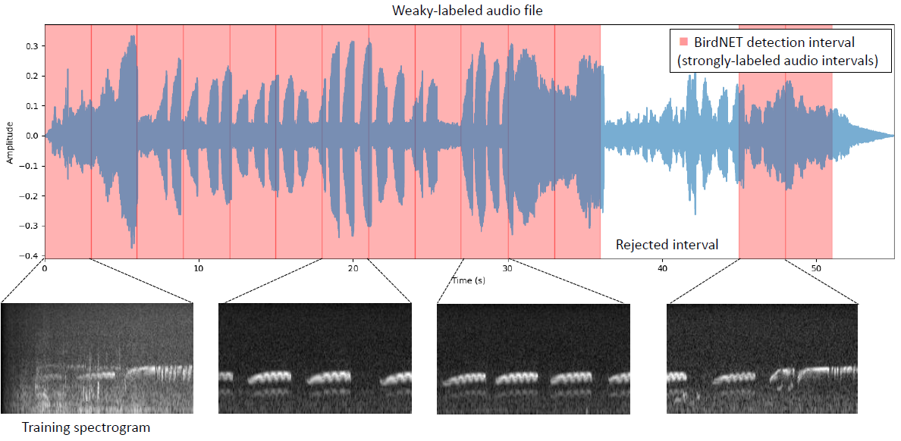

# DonanaAcousticModel

Python scripts for training bird species classification models from audio recordings. This work is focused on species frequently observed in the Doñana Biological Reserve (Spain).


## Code

### Segmentation

Scripts for segmenting audio files into fixed-length chunks and converting them into spectrograms. Supports multiple segmentation and spectrogram generation methods.

- `preprocess.py`: main script to split audio and generate spectrograms.




### BirdNet

Adapted BirdNET scripts for running species classification and segmentation on raw audio.

- `setup_birdnet.py`: script to install the employed version of BirdNET.
- `execute_birdnet_segment_save.py.`: script for automatically running the BirdNET analysis + segmentation on subfolders. This provides
 BirdNET .txt tables, BirdNET's prediction logits, and extracted segments.


### Training

Scripts for training DNN models on the spectrogram dataset.

- `train_distill.py`: script to train a model using transfer learning from ImageNet or knowledge distillation from BirdNET's logits.
- `utils.py`: Helper functions for data loading, training, and evaluation.

### Models

Output folder with trained models. Model names follow this notation: `<CNN>-<resolution>-<n_labels>-<extra>`, where `wi` stands for *weight imprinting*, `ft` for *fine-tuning* and `q` for *quantized*. 

### Data

Species list employed in this work.

### Testing

- `analyze-audios.py`: end-to-end utility to load a trained model and evaluate it on audio files, producing classification results.

Example execution (see example prediction file `example-predictions.txt`):

```python analyze-audios.py --i <audiofolder> --o <predictionsfolder> --min_conf 0.5```


```
cat example-predictions.txt 
0.0     3.0     Bubo bubo       1.00    113954.mp3
6.0     9.0     Bubo bubo       1.00    113954.mp3
12.0    15.0    Ardea cinerea   0.97    113954.mp3
15.0    18.0    Bubo bubo       1.00    113954.mp3
```

### Embedded inference

- `analyze-audios-tflite.py`: end-to-end utility to load a trained model in TensorFLow Lite format, producing classification results.

Same prediction file is produced (`example-predictions.txt`)

### Notebooks

- `example-analyze-tflite.ipynb`: example of loading a trained model and evaluate it an audio file, showing classification results.

